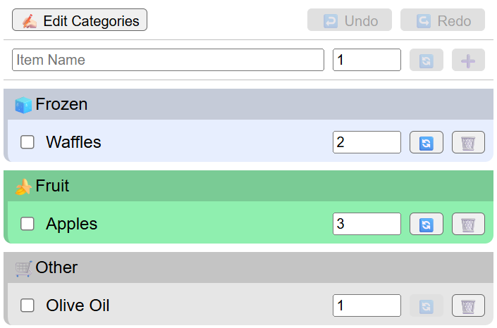

# TypeScript MVC Shopping Cart

A modern shopping cart application built with TypeScript using the Model-View-Controller (MVC) architectural pattern.

## Tech Stack
- TypeScript - For type-safe development
- HTML Template Tag - For type-safe HTML templates
- Vite - For fast development and building

## Demo



## Features

- Clean MVC architecture implementation
- TypeScript for type safety and better development experience
- Modern build tooling with Vite
- HTML template support with html-template-tag

## Prerequisites

- Node.js (latest LTS version recommended)
- npm or yarn package manager

## Installation

1. Clone the repository
2. Install dependencies:
```bash
npm install
```

## Development

To start the development server:
```bash
npm run dev
```

The application will be available at `http://localhost:5173` (or the next available port).

## Building for Production

To create a production build:
```bash
npm run build
```

To preview the production build:
```bash
npm run preview
```

## Project Structure

- `src/` - Source code directory
  - Contains MVC components and application logic
- `public/` - Static assets
- `index.html` - Main HTML entry point
- `tsconfig.json` - TypeScript configuration
- `package.json` - Project dependencies and scripts

## Technologies Used

- TypeScript
- Vite
- HTML Template Tag
- MVC Architecture Pattern

